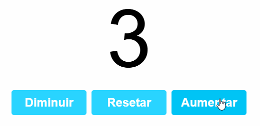

# 📂 Projeto: React Counter

## 📋 Descrição

Este é um contador simples desenvolvido com **React** utilizando o hook `useState`.  
O objetivo deste projeto é praticar conceitos fundamentais do React, como:

- Componentes funcionais
- Hooks (`useState`)
- Manipulação de estado
- Interação com eventos

Além disso, o projeto reforça boas práticas como **organização de código limpo** e **separação de responsabilidades**.

---

## 🧠 Conceitos abordados

- Criação de componentes funcionais
- Controle de estado com `useState`
- Atualização dinâmica do DOM virtual
- Estilização básica com CSS
- Manipulação de eventos (`onClick`)

---

## 📷 Prévia



---

## 🌐 Demonstração online

Acesse o projeto em produção aqui:  
🔗 [https://react-counter-silk.vercel.app/](https://react-counter-silk.vercel.app/)

---

## 🚀 Como executar o projeto

```bash
# 1. Clone o repositório
git clone https://github.com/seu-usuario/react-counter.git

# 2. Instale as dependências
npm install

# 3. Inicie o projeto
npm start
```

---

## 🛠️ Tecnologias utilizadas

- ⚛️ **React.js**  
- 🟨 **JavaScript (ES6+)**  
- 🧱 **HTML5** + 🎨 **CSS3**  
- ⚡ **Vite**

---

## 📌 Observações

Mesmo sendo um projeto simples, ele serve como base para aplicações mais robustas, com múltiplos estados e interações.  
Ideal para iniciantes que estão começando no ecossistema React!

---

## 🙋‍♂️ Autor

**Fábio**  
🎓 Estudante de Engenharia de Software  
💻 Foco em desenvolvimento full stack, IA, e automação com Python  
🚀 Em constante evolução  
🔗 [GitHub](https://github.com/faber-studies) | 📸 [Instagram](https://instagram.com/fabio.estudos)

> ⚠️ Este projeto foi desenvolvido com base em um tutorial no YouTube, com o objetivo de **praticar conceitos do React** e **reforçar o aprendizado**. Todo o código foi refeito manualmente para fins educacionais.

```
